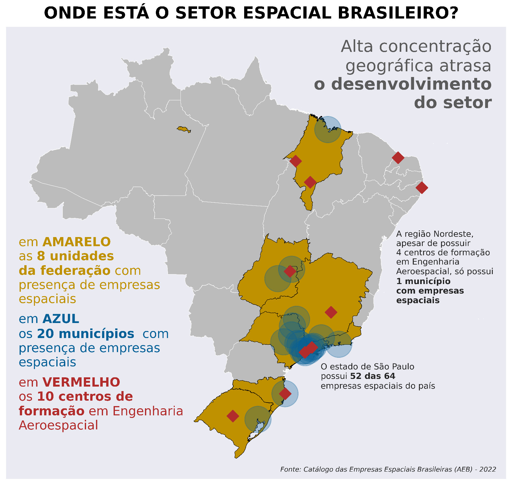

# Where is the Space Sector in Brazil?
<!-- PROJECT LOGO -->
 

  

<h3 align="center">Can an higly concentrated industry flourish in a continent-size country like Brazil?</h3>

  

    This is a short project in which I produce the graphic visualization above, in order to ilustrate the geographic configuration of the space sector in Brazil, contrasting the variety of regions that offer academic formation in Aerospace Engineering against a highly concentrated industry, situated in the state of São Paulo.
     
    <a href="https://github.com/alessandro-avancini/AEB-where-is-the-space-sector-in-Brazil/blob/main/where-is-the-space-sector-in-brazil.ipynb"><strong>Explore the notebook »</strong></a>
     
     
  

<!-- TABLE OF CONTENTS -->

  
Table of Contents

  <ol>
    <li>
      <a href="#about-the-project">About The Project</a>
      <ul>
        <li><a href="#built-with">Built With</a></li>
      </ul>
    </li>
    <li><a href="#contact">Contact</a></li>
  </ol>

<!-- ABOUT THE PROJECT -->
## About The Project

The space sector has its own set of singularities and caracteristics. It is a higly technological industry, investments carry big risks and the workforce must be higly educated. Those are complexities that make it hard to understand the forces that influence the dynamics of the sector. This project was designed to illustrate the disparities between aerospace engineering degree's geographical location versus the space companies' location in the country. The visualization integrates a master's degree publication from a Brazilian Space Agency (AEB) researcher that is studying, among other things, the geographical concentration of the sector's industry in the Southeast region of Brazil, specially in the state of São Paulo, that houses 52 out of 64 catalogued by AEB records.

It consists in two parts: The first is the acquisition of the geographical coordinates of the universities and the second is the plot itself. Geopandas methods were used to handle spatial data and the high customization offered by matplotlib was fundamental to create that personalized style and give a professional-looking graphic that could showcase the data in an objective and easy to undestand way. 

### Built With

<!-- CONTACT -->
## Contact

Alessandro Avancini - alessandro.avancini0@gmail.com

Project Link: [https://github.com/alessandro-avancini/AEB-where-is-the-space-sector-in-Brazil](https://github.com/alessandro-avancini/AEB-where-is-the-space-sector-in-Brazil)
